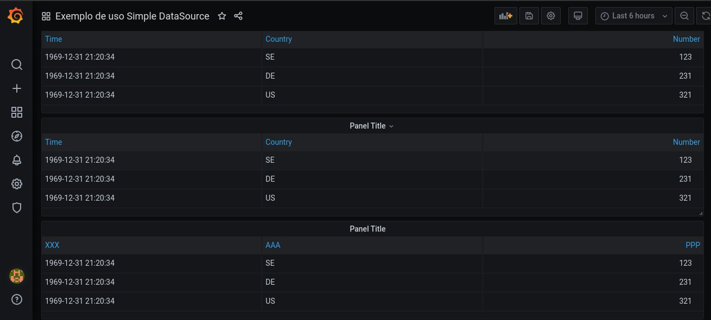

# Exemplo de Uso do Plugin Grafana Simple Json Datasource

Este repositório contém um [docker-compose](./docker-compose.yaml) que orquestra dois containers. O primeiro container orquestrado é uma instância do Grafana, o outro container é uma instância de um WebServer em Python, criado com o micro-framework Flask.
Para levantar o ambiente, basta executar:

```bash
docker-compose up --build
```

O [webserver](ws/app.py) implementa os endpoints `/query` e `/search`. Estes endpoints são requisitados pelo Grafana, por meio do [Plugin simple-json-datasource](https://github.com/grafana/simple-json-datasource), e pela estrutura do JSON que é retornado, o plugin é capaz de renderizar _tables_ e _timeseries_.

# Prints de Configuração

 
 
 
 
 
 

# Exemplo de saída

```bash
$ python3 ws/app.py 
 * Serving Flask app "app" (lazy loading)
 * Environment: production
   WARNING: This is a development server. Do not use it in a production deployment.
   Use a production WSGI server instead.
 * Debug mode: off
 * Running on http://0.0.0.0:8000/ (Press CTRL+C to quit)
/search
{'target': 'equips'}
USERNAME: carlos
PASSWORD: neto
Custom Header: 123
127.0.0.1 - - [18/Aug/2020 00:01:52] "POST /search HTTP/1.1" 200 -
/query
{'app': 'dashboard', 'requestId': 'Q477', 'timezone': 'browser', 'panelId': 2, 'dashboardId': 1, 'range': {'from': '2020-08-17T21:01:52.857Z', 'to': '2020-08-18T03:01:52.857Z', 'raw': {'from': 'now-6h', 'to': 'now'}}, 'timeInfo': '', 'interval': '20s', 'intervalMs': 20000, 'targets': [{'target': 'a', 'refId': 'A', 'type': 'table'}], 'maxDataPoints': 1221, 'scopedVars': {'__interval': {'text': '20s', 'value': '20s'}, '__interval_ms': {'text': '20000', 'value': 20000}}, 'startTime': 1597719712859, 'rangeRaw': {'from': 'now-6h', 'to': 'now'}, 'adhocFilters': []}
USERNAME: carlos
PASSWORD: neto
Custom Header: 123
```