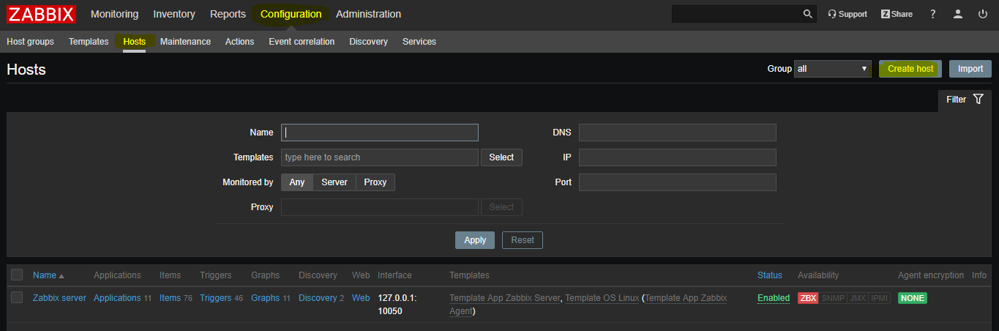
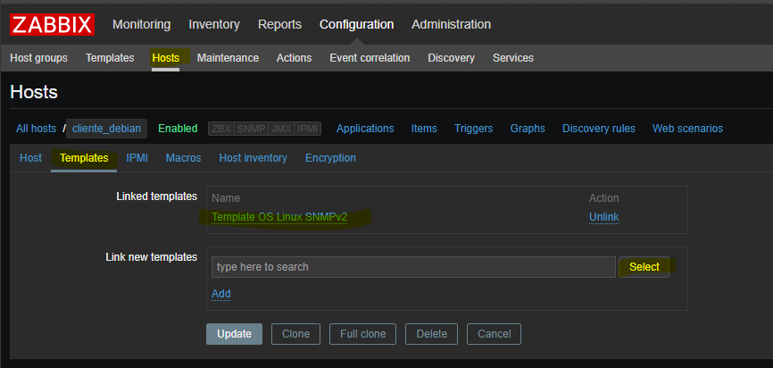
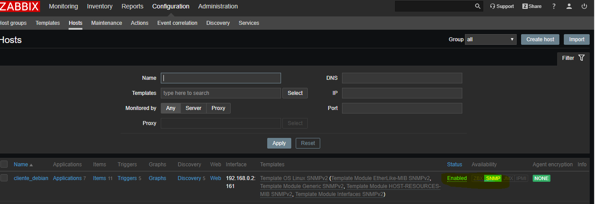
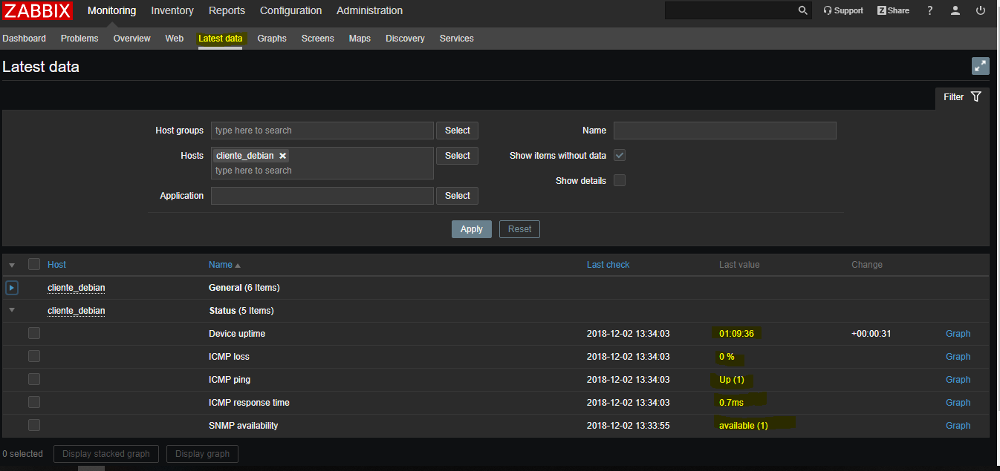
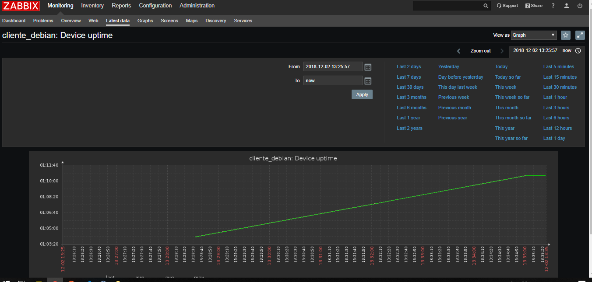

# Gerenciamento Zabbix em ambiente Linux, para a monitoração de uma estação Linux através do protocolo SNMP.

## Cenário

> **Servidor Zabbix:**  
>> Placas de rede:
>>> * enp0s3 - 192.168.1.1/24 - Modo bridge
>>> * enp0s8 - 192.168.0.1/24 - Rede Interna

> **Estação Debian:**
>> Placas de rede:
>>> * enp0s3 - 192.168.1.19/24 - Modo bridge
>>> * enp0s8 - 192.168.0.2/24 - Rede Interna

---

# SERVIDOR

## Instalação do Servidor Zabbix

* Na máquina servidor, baixar Repositorio do MySQL database, via ```wget``` 

```
# wget https://repo.zabbix.com/zabbix/4.0/debian/pool/main/z/zabbix-release/zabbix-release_4.0-2+stretch_all.deb
```

* Instalar o pacote com gerenciador de pacote ```dpkg``` (caso o servidor for Debian) 

```
# dpkg -i zabbix-release_4.0-2+stretch_all.deb
```

* Instalar Zabbix server, o frontend, e um agente para o servidor

```
# apt udpate
# apt install zabbix-server-mysql zabbix-frontend-php zabbix-agent
```

* Criar um banco de dados para hospedar os dados oriundos dos serviços do Zabbix

```
# mysql -uroot -p
# <INSERIR-SENHA-DO-BANCO-DE-DADOS>
# mysql> create database zabbix character set utf8 collate utf8_bin;
# mysql> grant all privileges on zabbix.* to zabbix@localhost identified by '<SENHA-DO-USUARIO-ZABBIX>';
# mysql> quit;
```

* Importe esquemas e dados iniciais para o banco de dados criado no passo anterior.

```
# zcat /usr/share/doc/zabbix-server-mysql*/create.sql.gz | mysql -uzabbix -p zabbix
```

* Configure o banco de dados para o servidor Zabbix, editando o arquivo ```/etc/zabbix/zabbix_server.conf```

```
DBPassword=<SENHA-DO-USUÁRIO-QUE-FOI-CRIADA-NOS-PASSOS-ANTERIORES>
```

* Configure o PHP para frontend do Zabbix, editando o arquivo ```/etc/zabbix/apache.conf```, remova o comentário e defina o fuso horário certo da região se necessário.

```
America/Sao_Paulo
```

* Inicie os processos do servidor e do agente do Zabbix e inicie na inicialização do sistema:

```
# systemctl restart zabbix-server zabbix-agent apache2
# systemctl enable zabbix-server zabbix-agent apache2
```

* Conecte-se ao frontend do Zabbix recém-instalado: 

```
http: // <IP-OU-DOMINIO-ZABBIX> / zabbix 
```

--- 

## Instalação do utilitário SNMP

* Para instalar o utilitário SNMP, execute

```
# apt-get install snmp
```

> Ele será importante para testar conexões com SNMP

* Para testar conexões SNMP, execute:

```
# snmpwalk -v2c -c public <IP-DA-MAQUINA-QUE-QUER-TESTAR-CONEXÃO> | head
```

> Se retornar dados semalhantes aos abaixo, significa que funcionou:

```
iso.3.6.1.2.1.1.9.1.4.4 = Timeticks: (3) 0:00:00.03
iso.3.6.1.2.1.1.9.1.4.5 = Timeticks: (3) 0:00:00.03
iso.3.6.1.2.1.1.9.1.4.6 = Timeticks: (3) 0:00:00.03
iso.3.6.1.2.1.1.9.1.4.7 = Timeticks: (3) 0:00:00.03
iso.3.6.1.2.1.1.9.1.4.8 = Timeticks: (3) 0:00:00.03
iso.3.6.1.2.1.1.9.1.4.9 = Timeticks: (4) 0:00:00.04
...
```

> OBS: Só irá funcionar se a máquina alvo tiver o SNMPD instalado, habilitado e configurado.

# MÁQUINA CLIENTE

* Na máquina cliente, instalar o pacote deamon do protocolo SNMP, nomeado ```SNMPD```

```
# apt update
# aptitude install snmpd
```

* Configurar o IP da máquina no arquivo de configuração do SNMPD

```
vim /etc/snmp/snmpd.conf
```

> Modificar a linha seguinte e deixar desta maneira:

```
agentAddress  udp:0.0.0.0:161
```

* Para verificar o funcionamento do serviço, execute

```
# netstat -ulnp | grep 161
```

> Deverá retornar algo parecido com.

```
udp        0      0 0.0.0.0:161             0.0.0.0:*                           984/snmpd
```

* Restart o serviço, execute

```
# systemctl restart snmpd
```

* Verifique se o serviço está "RUNNING"

```
# systemctl status snmpd
```

---

# CONFIGURAÇÃO DO ZABBIX

* Primeiro, deve-se criar um host

> Configuration -> Hosts -> Create Host




* Insira o IP em ```SNMP Interfaces```, coloque em algum grupo


* Adicione no template de SNMP



* Aguarde uns instantes, e verá o icone SNMP verde, que significa que o servidor está recebendo dados via SNMP do host



* Verificar o recebimento dos dados

> Monitoring -> Lastest data



* Verificar dados de maneira gráfica


