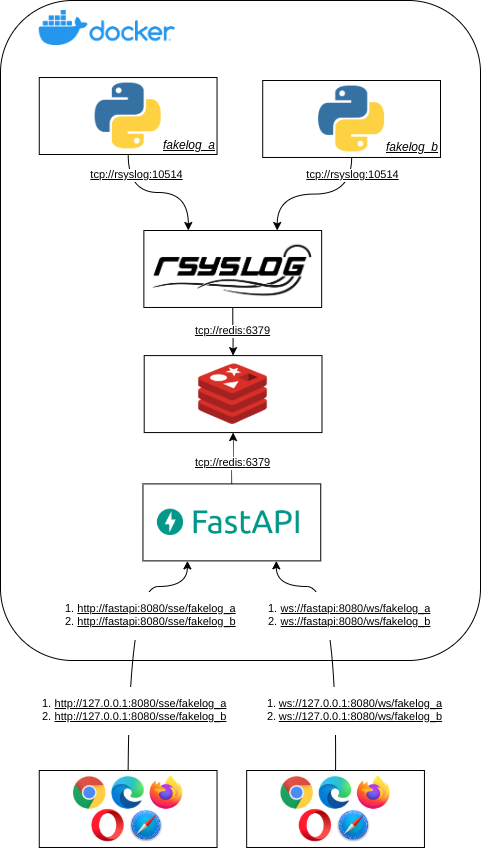

realtime-log-web-viewer
#######################

* **Data**: 10/12/2020

* **Autor**: @augustoliks | carlos.neto.dev@gmail.com

* **Descrição**: PoC de integração de tecnologias para possibilitar a visualização de logs em um ambiente de Web por meio dos protocolos WebSocket e SSE. Tecnologias escolhidas com foco em: simplicidade, consistência e extensibilidade. 

* **Objetivo**: Exibir log de aplicações em tempo real em um ambiente Web.

Soluções Semelhantes
--------------------

- `log.io <https://github.com/NarrativeScience/log.io>`_: Solução simples e objetiva para visualizar logs de arquivos via ambiente Web;
- `Graylog <https://www.graylog.org/>`_: Solução robusta para visualização de logs de multiplas fontes.

A presente PoC, se enqudra no meio termo entre as duas soluções citadas. 

Tecnologias Utilizadas
----------------------

+--------------------+----------------------+
| Nome               | Versão               |
+====================+======================+
| rsyslog-hiredis    | 8.36.0               |
+--------------------+----------------------+
| redis              | 6.0                  |
+--------------------+----------------------+
| rsyslog            | 8.33.1               |
+--------------------+----------------------+
| python             | >= 3.7               |
+--------------------+----------------------+

Arquitetura da Solução
----------------------

As próximas subseções, irão explicar cada módulo exposto no diagrama, com exceção do Redis, em que sua configuração padrão, já satisfaz as necessidades do projeto.

Fakelogs ``fakelog_a`` e ``fakelog_b`` - Aplicações 
^^^^^^^^^^^^^^^^^^^^^^^^^^^^^^^^^^^^^^^^^^^^^^^^^^^

As aplicações ``fakelog_a`` e ``fakelog_b``, dão origem aos logs. Os logs são reencaminhados para o Rsyslog via TCP. O trecho do código responsável por conectar a aplicação com o Rsyslog. 

.. code-block:: python

    import loguru
    import logging
    ...

    logger.add(
        logging.handlers.SysLogHandler(address=('rsyslog', 10514))
    )

::

    Foi utilizado a biblioteca loguru por conta da simplicidade que ela oferece. Porém sua presença não é obrigatória, e pode ser substituída pela biblioteca logging.

Rsyslog - Receptor, Transformador e Publicador
^^^^^^^^^^^^^^^^^^^^^^^^^^^^^^^^^^^^^^^^^^^^^^

O Rsyslog foi configurado para satisfazer as seguintes três etapas: **Entrada**, **Filtro/Transformação** e **Saída**. 

Na etapa de **Entrada**, o Rsyslog foi configurado para receber os *log's* via protocolo TCP pela porta 10514. 

Segue o trecho que habilita esta funcionalidade.

:: 

    # Provides TCP syslog reception
    $ModLoad imtcp
    $InputTCPServerRun 10514

Já na etapa de **Filtro/Transformação**, os *log's* sofrem uma mudança na sua estrutura, de protocolo ``syslog`` para o protocolo ``gelf``.  

Segue o trecho responsável por executar a transformação.

::

    template(name="gelf_containers" type="list") {
        constant(value="{\"_app_name\":\"")         property(name="fromhost")
        constant(value="\",\"host\":\"")            property(name="$myhostname")
        constant(value="\",\"short_message\":\"")   property(name="msg" format="json")
        constant(value="\",\"timestamp\":")         property(name="timegenerated" dateformat="unixtimestamp")
        constant(value=",\"_group\":\"lr\"}\n")
    }

Por fim, na etapa de **Saída**, os logs transformados na etapa anterior, são enviados para uma instância do Redis. O envio é feito utilizando o modelo de comunicação Publish/Subscribe. Assim, é correto afirmar que os logs são publicados em um canal do Redis. O nome do canal em que será publicado o log, é definido pelo nome da aplicação que lhe-deu origem, ou seja, a aplicação **fakelog_a**, terá seus logs publicados no canal **fakelog_a**, e os logs da aplicação **fakelog_b**, serão os seus logs publicados no canal **fakelog_b**. 

Segue a configuração que implementa esta etapa.

::

    template(name="gelf_containers" type="list") {
        constant(value="{\"_app_name\":\"")         property(name="fromhost")
        constant(value="\",\"host\":\"")            property(name="$myhostname")
        constant(value="\",\"short_message\":\"")   property(name="msg" format="json")
        constant(value="\",\"timestamp\":")         property(name="timegenerated" dateformat="unixtimestamp")
        constant(value=",\"_group\":\"lr\"}\n")
    }

    module(load="omhiredis")
    action(
        name="publish_redis"
        template="gelf_containers"
        server="redis"
        serverport="6379"
        type="omhiredis"
        mode="publish"
        key="channel_app"
        dynakey="on"
    )

FastAPI - Web-Backend Provedor dos Logs em Tempo Real
^^^^^^^^^^^^^^^^^^^^^^^^^^^^^^^^^^^^^^^^^^^^^^^^^^^^^

Desenvolvido com a linguagem Python com o Framework Web FastAPI, este Backend tem a função de se conectar com o Redis e reencaminhar os logs para o Frontend por meio dos protocolos Websocket e SSE (Server Sent Event). De acordo com a rota em que os clientes fazem as requisições HTTP e conexões WS, o backend se inscreve em um canal específico do Redis, do qual é retransmitido os os *logs*.

O trecho de código abaixo, expõe a retransmissão de logs por meio de uma conexão SSE. 

.. code-block:: python

    @app.get("/sse/{application}")
    async def sse(application: str):
        async def stream(redis_subscriber):
            async for message in redis_subscriber[0].iter():
                if not message:
                    continue
                message_log_json = json.dumps(json.loads(message)) + '\n'
                logging.info(f"{ws}: {message_log_json}")
                yield message_log_json.encode(encoding='utf-8')

        channel_name = f'{application}.realtime-log-web-viewer_default'

        redis = await aioredis.create_redis(REDIS_ADDRESS)
        redis_subscriber = await redis.subscribe(channel_name)

        return StreamingResponse(stream(redis_subscriber))

O canal Redis em que o Backend se inscreverá, é declarado no valor passado no lugar de ``{application}`` na rota ``/sse/{application}``.

As comunicações Websocket seguem a mesma ideia da SSE. Segue o código.

.. code-block:: python

    @app.websocket("/ws/{application}")
    async def ws(ws: WebSocket, application: str):
        await ws.accept()

        # my_application_fakelog_a_realtime-log-web-viewer_default
        channel_name = f'{application}.realtime-log-web-viewer_default'

        redis = await aioredis.create_redis(REDIS_ADDRESS)
        redis_subscriber = await redis.subscribe(channel_name)

        while True:
            try:
                async for message in redis_subscriber[0].iter():
                    if not message:
                        continue
                    try:
                        message_log_json = json.loads(message)
                        logging.info(f"{ws}: {message_log_json}")
                        await ws.send_json(message_log_json)
                    except (ConnectionClosed, WebSocketDisconnect):
                        logging.info(f"{ws}: disconnected from channel {channel_name}")
                        return
            except Exception as e:
                logging.error(f"read timed out for stream {channel_name}, {e}")
                return

Referências
===========

- https://www.rsyslog.com/doc/v8-stable/configuration/modules/omhiredis.html
- https://github.com/elementary-robotics/redisconf-2020-streams-fastapi
- https://amittallapragada.github.io/docker/fastapi/python/2020/12/23/server-side-events.html
