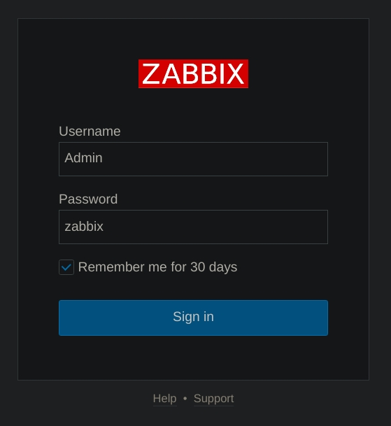
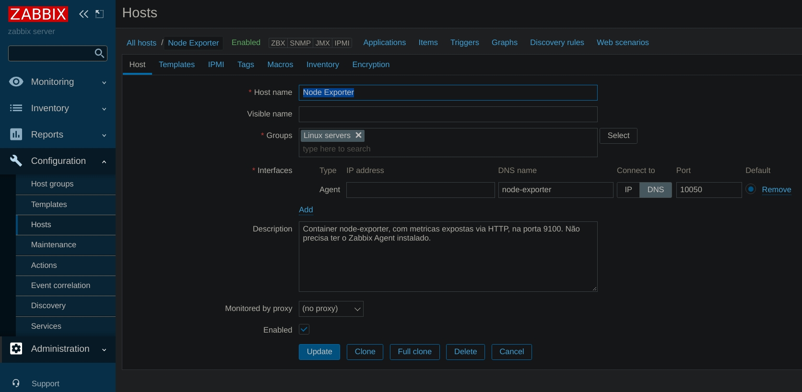
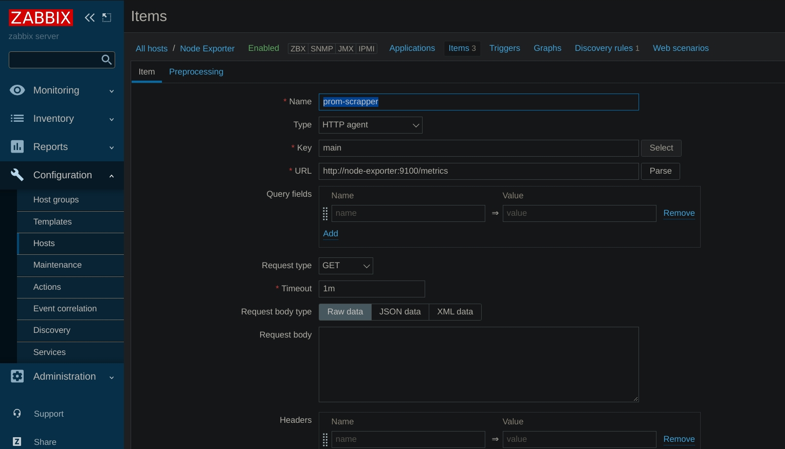
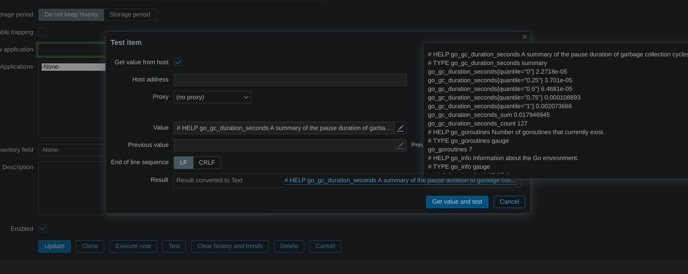
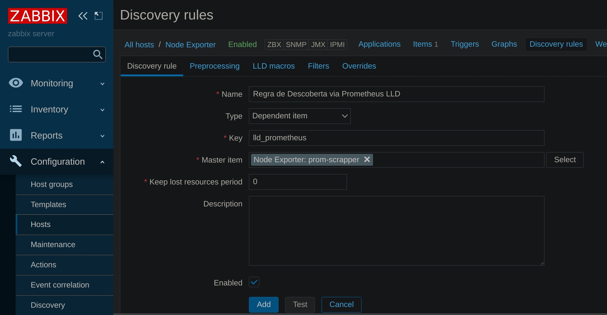
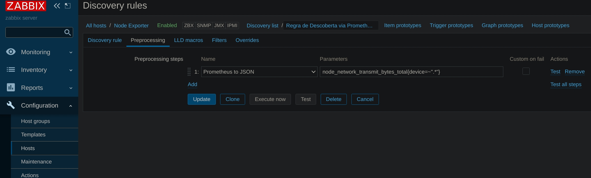
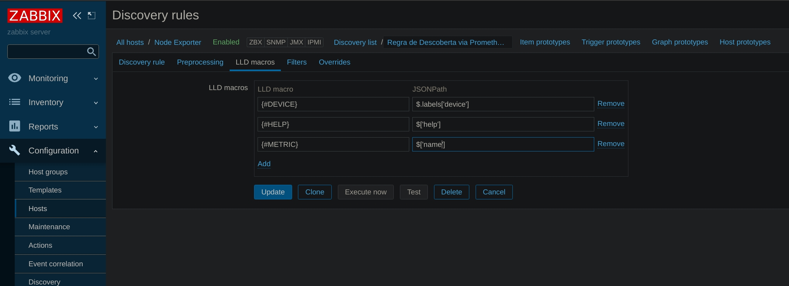
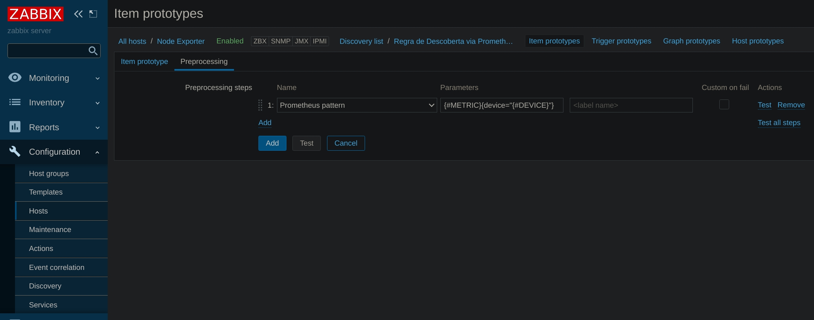
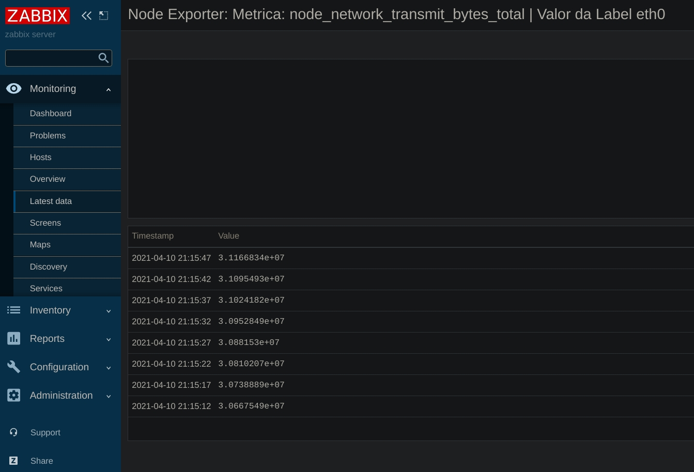

zabbix-lld-prometheus
=====================

Criação de itens no Zabbix, de forma dinâmica atráves do recurso *Discovery Rule*, com base em *scraps* em tempos regulares, feitos en um *Prometheus Exporter*.

    Repositório criado para propósitos educacionais.

Passo a Passo
-------------

Provisionamento do Ambiente
^^^^^^^^^^^^^^^^^^^^^^^^^^^

Baixe o projeto e provisione o ambiente.

.. code:: shell

    git clone https://github.com/augustoliks/zabbix-lld-prometheus
    cd zabbix-lld-prometheus/zabbix/
    docker-compose pull
    docker-compose up -d 

Aguarde alguns segundos para que o banco de dados PostgreSQL seja configurado.

Login no Zabbix
^^^^^^^^^^^^^^^

Acesse http://localhost:8081/, e insira as credenciais:

- user: ``Admin``
- password: ``zabbix``

Crie o Host a ser Monitorado
^^^^^^^^^^^^^^^^^^^^^^^^^^^^

Crie o Item Scrapper do Prometheus 
^^^^^^^^^^^^^^^^^^^^^^^^^^^^^^^^^^

Crie um item do tipo ``HTTP Agent``, com a URL de acesso ao endpoint de métricas do container com o prometheus com *Exporter*.

O item fará requisições em tempos regulares ao prometheus exporter, e vai consultar as métricas que servirão como base para a *Low Level Discovery* posteriomente criada.

Teste o *Scrap*.

Crie uma Discovery Rule
^^^^^^^^^^^^^^^^^^^^^^^

Selecione o equipamento recém criado, e clique na opção *Discovery Rule*. Indique o tipo ``Dependent item``.

Esta *Discovery Rule* será responsável por parsear o resultado do *Item Scrapper*, e criar itens de forma dinâmica.

Especifique a Métrica Prometheus que Será Transformada em Item Zabbix
^^^^^^^^^^^^^^^^^^^^^^^^^^^^^^^^^^^^^^^^^^^^^^^^^^^^^^^^^^^^^^^^^^^^^

É necessário especificar a métrica que será transformada em item Zabbix. No exemplo, será criado diversos itens de acordo com a label.

A opção ``Prometheus to JSON``, fará o *parse* da métrica para JSON, para facilitar o acesso aos atributos e valores na etapa de criação de Macros.

Especifique as Macros
^^^^^^^^^^^^^^^^^^^^^

No passo anterior especificamos qual métrica queremos, nesta etapa, especificaremos o quê das métricas será recuperado para a criação do item.

Crie um Item Prototype
^^^^^^^^^^^^^^^^^^^^^^

Com base nas Macros recém criadas, criaremos em fim, o protótipo que será utilzados para criar itens de forma dinâmica, de acordo com a label da metrica informada.

.. image:: .doc/09-item-prototype.jpg
   :target: .doc/09-item-prototype.jpg

Indique será feito acesso ao valor do item.

Visualize os Itens Criados
^^^^^^^^^^^^^^^^^^^^^^^^^^

Se tudo funcionar de forma correta, ao acessar a opção *Latest Data* do Host criado, será acessível os itens criados via LLD.

.. image:: .doc/12-last-data.jpg
   :target: .doc/12-last-data.jpg

Segue a consulta por histórico.

Referencias
-----------

- Zabbix 4.2 — Prometheus Integration:

    https://blog.zabbix.com/zabbix-4-2-prometheus-integration/7558/
