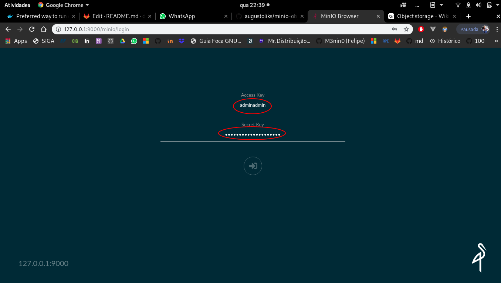
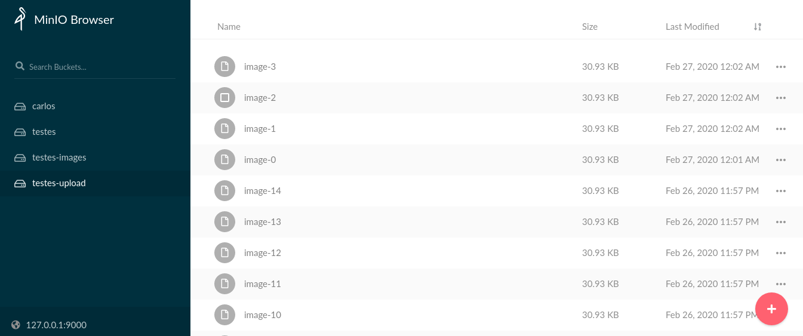
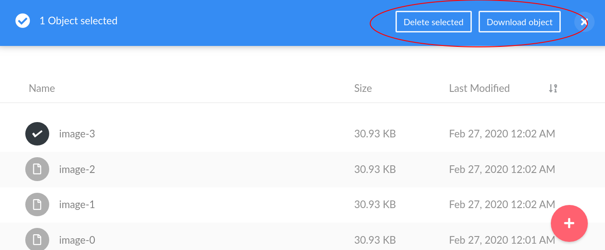

# minio-object-storage

Projeto que traz uma arquitetura em container de um cliente que fará um upload de uma imagem a um [Object Storage](https://en.wikipedia.org/wiki/Object_storage). O _Object Storage_ está implementado com o [MinIO](https://min.io), e o cliente está desenvolvido com Python.

## Depêndencias

| Nome           | Versão | Descrição                                             |
| -------------- | ------ | ----------------------------------------------------- |
| Docker         | 19.0.3 | Utilizado para criação e execução dos containers      |
| docker-compose | 1.25.0 | Utilizado para orquestração dos containers            |


## Instalação e Execução

Para executar o projeto, executar:

```shell_script
$ git clone https://github.com/augustoliks/minio-object-storage 
$ cd minio-object-storage
$ docker-compose up
```

## Configuração

Os subtópicos abaixo, são os passos necessários para a configuração e acesso ao _Object Storage_, e deverão ser seguidos sequencialemente.

### Login

Em seu browser, acessar o endereço `http://127.0.0.1:9000`, e inserir as seguintes credênciais:

- Access Key: adminadmin
- Secret Key: adminadmin

A imagem abaixo mostra onde será inserida as credenciais:



### Execução

Ao executar o [docker-compose do projeto](./docker-compose.yaml), o cliente Python vai criar um _Bucket_ chamado `testes-upload` e começar a fazer upload [deste arquivo](./python-client/file.jpg). Ao receber arquivos, é esperado que o frontend do MinIO fique parecido com a imagem abaixo:



### Download das imagens

Para fazer downloads das imagens, basta clicar na correspondida e selecionar a opção requirida.



# Referências

- Overview sobre o minio: https://www.youtube.com/watch?v=vF0lQh0XOCs
- O que é um Object Storage: https://en.wikipedia.org/wiki/Object_storage
