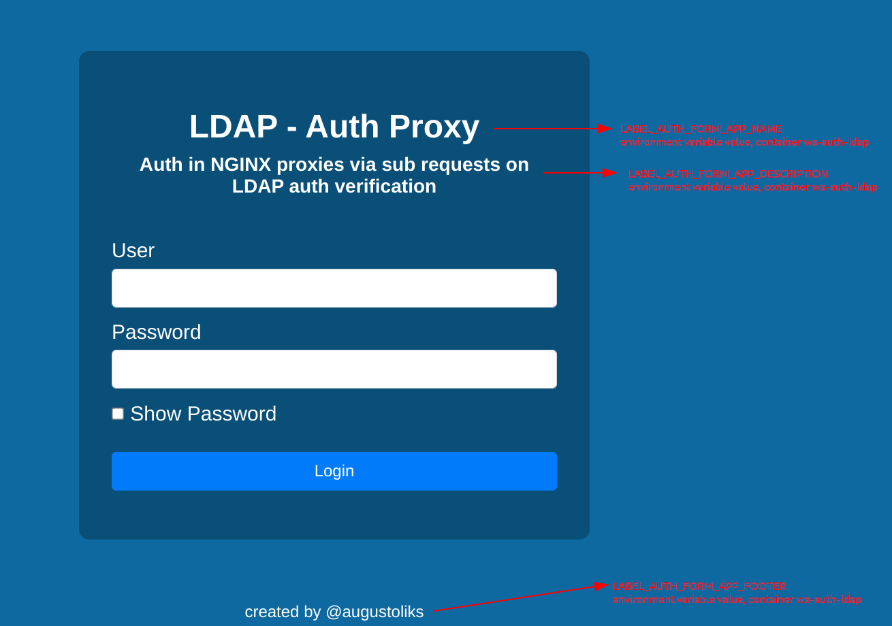
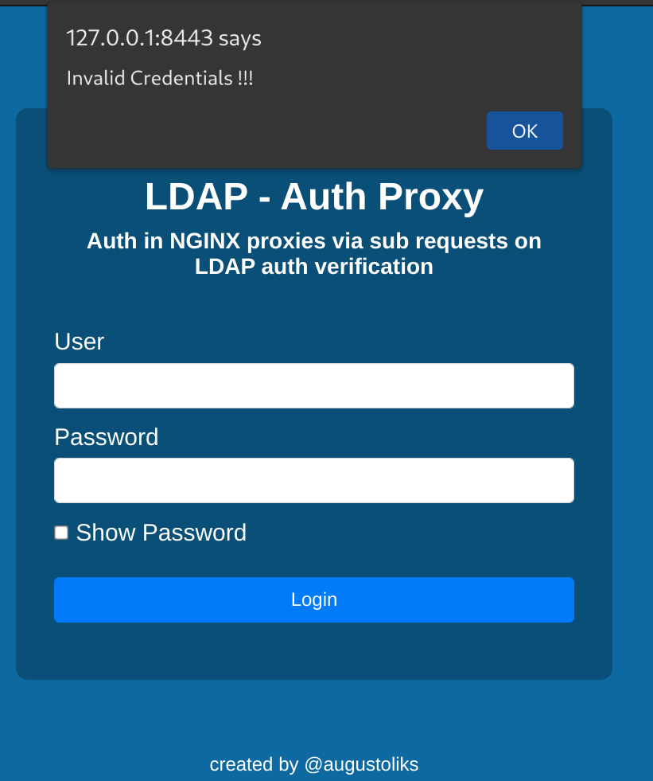
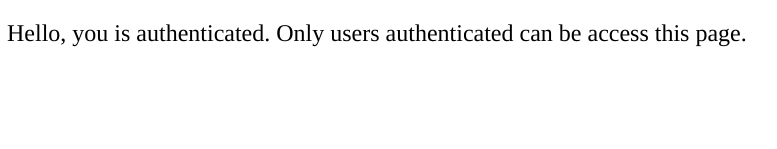

# nginx-auth-proxy-ldap

Auth Proxy with NGINX via subrequests feature, using LDAP credentials source.

This project consists of two services, wrapped in Container format, `ws-auth-ldap` and `web-nginx`. First, is a web service (Python + Flask), responsible for render a web auth form, and validate credentials in LDAP server. Second, is NGINX instance, that provides access on `ws-auth-ldap` instance. The `web-nginx` it is responsible for declare LDAP settings to `ws-auth-ldap`, and verify credentials inserted on `ws-auth-ldap` web auth form.

> *Project created for educational purposes*

## Configuration 

Container configuration was made via environment variables.

- `web-nginx`

Environment Variable                    | Description
---                                     |---
NGINX_SERVER_NAME                       | This value will be evaluate ``server_name`` NGINX propertie. Multiple domains should be declared with space character
NGINX_AUTH_PROXY_LDAP_URL               | Access URL to LDAP server (example: ``ldap://servidor.ldap:389``)
NGINX_AUTH_PROXY_LDAP_BASE_DN           | LDAP DN that contains User Object informed in web form application
NGINX_AUTH_PROXY_LDAP_BIND_DN           | LDAP Object intergration user, used to access LDAP server to check credentials of users
NGINX_AUTH_PROXY_LDAP_BIND_PASSWORD     | LDAP Object Password intergration user
NGINX_AUTH_PROXY_LDAP_SEARCH_FILTER     | LDAP query to retrieving objects (example: `(sAMAccountName={USERNAME})`). `{USERNAME}` constant, will be replaced for User inserted on Auth Web Form.
NGINX_AUTH_PROXY_LDAP_REALM             | HTTP Realm, utilized in cases 401-Unauthorized (WWW-Authenticated Header)
NGINX_AUTH_PROXY_LDAP_DISABLE_REFERRALS | Option to disable LDAP Referrals in Active Directory. Options available: `1` to true, `0` to false
NGINX_AUTH_COOKIE_NAME                  | * Cookie name utilized to store credentials user 
NGINX_AUTH_PROXY_LDAP_STARTTLS          | Establish a STARTTLS connection with LDAP Server:  Options available: `1` to true, `0` to false

> *: :warning: credentials is stored with simetric AES cryptography

--- 

- `ws-auth-ldap`

Environment Variable                    | Description
---                                     |---
LOG_LEVEL                               | Log level of application. Options available `DEBUG`, `INFO`, `WARNING`, `ERRO`, `CRITICAL`
AUTH_COOKIE                             | * Cookie Name utilized to store credentials
LABEL_AUTH_FORM_APP_NAME                | Application Name renderized in Web Auth Form frontend 
LABEL_AUTH_FORM_APP_DESCRIPTION         | Application Description renderized in Web Auth Form frontend
LABEL_AUTH_FORM_APP_FOOTER              | Application footer renderized in Web Auth Form frontend

> *: :warning: credentials is stored with simetric AES cryptography

## Provides Environment

Provisioning Application created with `docker-compose`. To up containers, execute:

```bash
docker-compose up -d --build
```

To launch application, access https://127.0.0.1:8443



If Credentials invalid, will be showing follow alert



Else, user will be redirect restricted page in NGINX static folder. 


